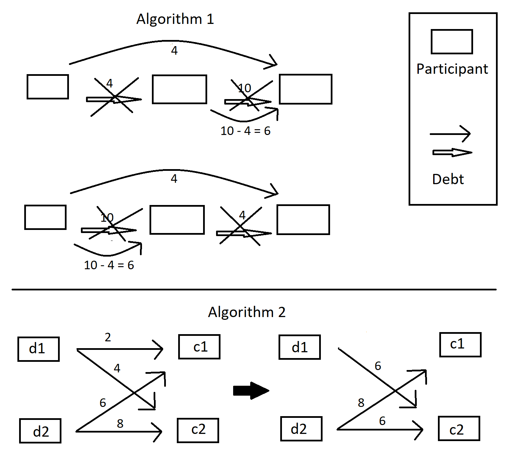

# PayBack
A web application to optimize the transactions when paying back debts.

## Background
There are tons of applications to help share bills. I started to wonder the algorithms used to optimize this problem and wanted to take my shot at the case.

Originally, I created an app to just test the designed algorithms but ended up turning it into a web application for demonstration purposes. It lacks a proper user interface, which reflects my current interests: back end.

## Algorithms
The used algorithms are presented in the picture below.

## Framework
Django

## Additional notes
Time complexity of the algorithms is poor in terms of the number of participants. However, in the context of this kind of software it should not be a problem.

The data related to debts is basically a directed graph. A library for graphs could have been used to implement it.